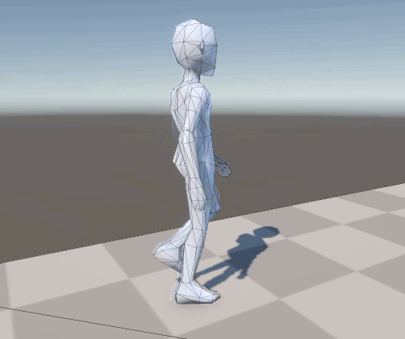
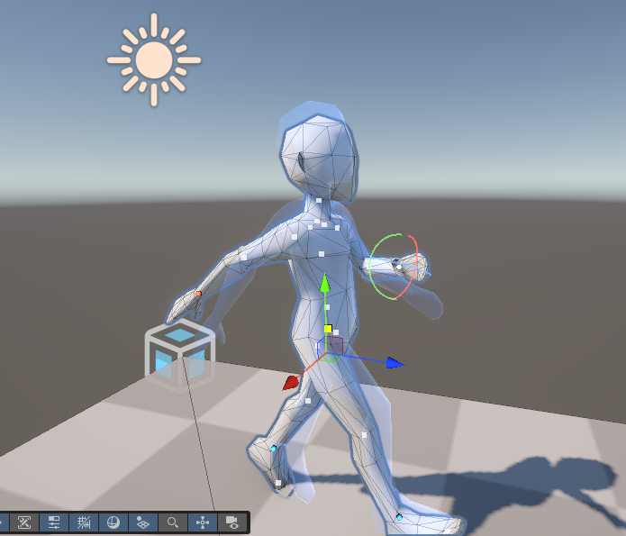
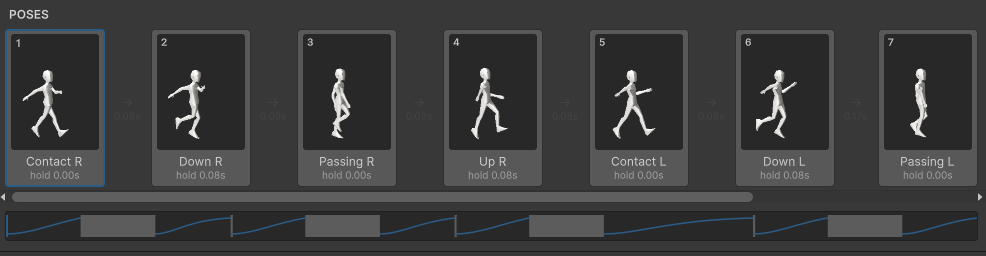

<p align="center"></p>

# Vibrations

[](https://unity.com/releases/unity-6)
[](https://github.com/ValDesu/Vibrations/tags)
[](#install)
[](#requirements)
[](#ai-assistant)
[](https://www.instagram.com/meowartsgames/)

**Pose-to-pose animations for Unity.** Set a few key poses on a Humanoid character and Vibrations snaps between them and bakes a standard `AnimationClip` for your Animator.

<p align="center">
  
  
</p>

> [!WARNING]
> Vibrations is made for **prototyping stylized animations fast**. It's not meant to replace a full
> animation tool like Blender or Unity's Animation window for final, polished animation work.

## Workflow

1. **Drag the character into place.** Grab a hand or a foot and move it: IK bends the arm or leg for you. The character stays grounded on the floor the whole time, so you never fix heights by hand (turn **Grounded** off on a pose to lift it, like the top of a jump).
2. **Add a few poses.** Click **+** to copy the current pose, move things around, repeat.
3. **Humanize it.** Turn on Humanize and the spine and head follow the body's movement on their own.

Press Play, then **Export Clip**, and you're done.

## Features

- **Snappy tweens, not linear keys.** Each transition is a spring with snap time, overshoot and wind-up,
  or Linear / Smooth curves for regular animation.
- **Feel presets.** Snappy, Pixar, Rubbery, Stop-motion, Heavy, Linear, Soft. Plus choppiness (animate on
  twos), overlap, and looseness so arms drag and keep swinging after the body snaps.
- **Fast posing.** IK handles on hands and feet, a hips handle that keeps feet planted, rotation rings on
  every joint, a floor that feet snap to, onion skin, and one-click left ↔ right mirroring.
- **Global Edit.** Click the tool icon on the pose strip, rotate joints on one pose (arms a bit wider, head lower...),
  and apply the same change to every pose at once. An orange ghost shows the pose before.
- **Humanize.** Joint limits, moving holds, auto-inbetweens for big jumps, subtle life, and automatic
  spine and head follow-through driven by the body's movement.
- **Templates.** Starter animations (Pixar Walk, Sneak, Idle, Walk, Run, Jump, Sit down, Wave), each with
  its own feel. Save your own and share them with the team. They work on any Humanoid character.
- **Any Humanoid rig.** Open an animation on a character with a different rig and click
  **Make a Copy for This Character**: the poses are converted through Humanoid muscles, no template needed.
- **Timing bar.** The whole animation to scale. Drag edges to change holds and snap times.
- **AI assistant (optional).** Prompt Claude or GPT to fill in-betweens, fix timing or tune the feel. It
  edits the animation through Vibrations' tools and renders previews to check its own work.
- **Clean export.** A Humanoid `.anim`, in place (no root motion), at 30 or 60 fps. It plays on any
  Animator with no extra components.

## Requirements

- Unity 6 (developed and tested on **Unity 6.6**).
- A character with a **Humanoid** rig. Mixamo characters work out of the box: import the FBX, set
  *Rig → Animation Type* to **Humanoid**, then Apply.

## Install

In Unity: **Window → Package Manager → + → Install package from git URL…** and paste:

```
https://github.com/ValDesu/Vibrations.git?path=/Packages/com.meowarts.vibrations
```

Or add it to `Packages/manifest.json`:

```json
{
  "dependencies": {
    "com.meowarts.vibrations": "https://github.com/ValDesu/Vibrations.git?path=/Packages/com.meowarts.vibrations"
  }
}
```

To pin a version, add a tag at the end: `...?path=/Packages/com.meowarts.vibrations#v0.2.2`.
To update, use **Update** in the Package Manager, or change the tag.

Unity installs the dependency (Newtonsoft JSON, an official Unity package) automatically.

## Quick start

1. Put your Humanoid character in a scene.
2. Open **Window → Vibrations** and pick the character in **Character**.
3. Click **New** to create an animation, or open the **Templates** tab and click a template.
4. Pose in the Scene view:
   - drag the **spheres** to move hands and feet (IK)
   - drag the **cube** to move the hips (feet stay planted)
   - click any **joint** to rotate it with the rings
5. Click **+** on the pose strip to add the next pose. Repeat for 2 to 8 poses. Drag cards to reorder them
   (Shift-click to grab several), and right-click to duplicate, mirror (left ↔ right) or copy/paste poses. For a walk, pose one
   step and use **Duplicate Mirrored** for the other.
6. Press **Play**. Tune the feel in the **Feel** tab and the rhythm in the timing bar.
7. Click **Export Clip**. You get a `.anim` next to the animation asset. Put it in an Animator Controller
   with **Apply Root Motion off**.

Animations are saved as assets, so you can reopen them, edit and re-export at any time. Re-exporting keeps
the same clip file, so Animator references stay valid.

## The window



| Tab | What's in it |
|---|---|
| **Animate** | Character, animation, play/scrub/export, pose cards, timing bar, selected pose and tools |
| **Templates** | Starter animations and your team's saved templates |
| **Feel** | Presets, transition curve, choppiness, overlap, looseness |
| **Humanize** | Joint limits, moving holds, inbetweens, life, head/torso follow-through |
| **Scene** | Onion skin, floor |
| **AI** | Prompt an AI to edit the animation (needs an API key) |
| **Settings** | Clip frame rate, default feel, export/templates folders, AI provider and key |
| **Support** | Our game and socials |

## AI assistant

1. **Settings → AI Assistant**: pick **Anthropic** or **OpenAI**, paste your API key, and check the model
   name (defaults: `claude-sonnet-5`, `gpt-5`).
2. **AI** tab: type a prompt or click a quick prompt (*Fill in-betweens*, *Fix timing*, *Snappier*, *Softer*,
   *Pixar feel*).

Good to know:
- **Your key stays on your computer.** It's stored in Unity's EditorPrefs, never in the project or in git.
- **What gets sent:** each prompt sends the animation's poses (as Humanoid muscle values) and settings, plus
  preview images, to the provider you picked. Usage is billed to your API account.
- **Undo:** a whole AI run is a single undo step, and Cancel stops it.

## Tips

- **Uneven timing is what gives motion flow.** Hold key poses longer, keep breakdowns short. Click **Auto Timing**
  under the timing bar for a first pass, then drag the edges to fine-tune (**Reset Timing** undoes it).
- **Snappy body + high looseness** gives the Pixar-style drag and swing in the arms.
- **With choppiness at 12**, keep holds and snap times in multiples of 1/12 s so every pose lands on a frame.
- **Clean up after posing:** *Fix All* (Animate tab → Tools) centers and grounds every pose.
- **Change every pose at once:** turn on *Global Edit* (tool icon, top right of the pose strip), rotate joints on the
  selected pose, then *Apply to All*. Shift/Cmd-click cards first to change only those.

## Limitations

- Humanoid rigs only.
- Fingers, eyes and jaw aren't animated yet.
- Exported clips are in place (no root motion). Move the character from gameplay code.
- Joint limits follow the avatar's muscle settings, so extreme overshoot can be clipped by the Humanoid system.

## Working on Vibrations

This repository is a Unity 6.6 project that embeds the package in `Packages/com.meowarts.vibrations`:

- `Assets/Characters/default.fbx` and `Assets/Scenes/Vibrations.unity`: a test character and scene.
- `Packages/com.meowarts.vibrations/Editor`: the tool.
- `Packages/com.meowarts.vibrations/Tests`: EditMode tests (**Window → General → Test Runner**).

To run the tests from the command line:

```
Unity -batchmode -projectPath . -runTests -testPlatform EditMode -testResults results.xml
```

To release a version: bump `version` in `Packages/com.meowarts.vibrations/package.json`, add an entry to
its `CHANGELOG.md`, commit, then tag `vX.Y.Z` and push the tag.
